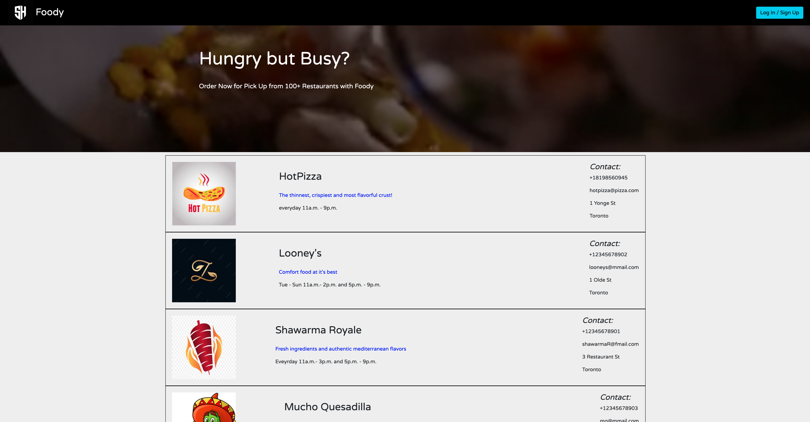
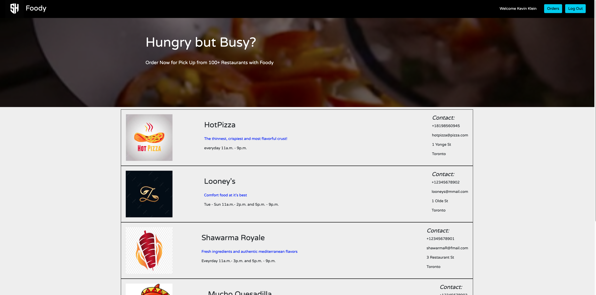
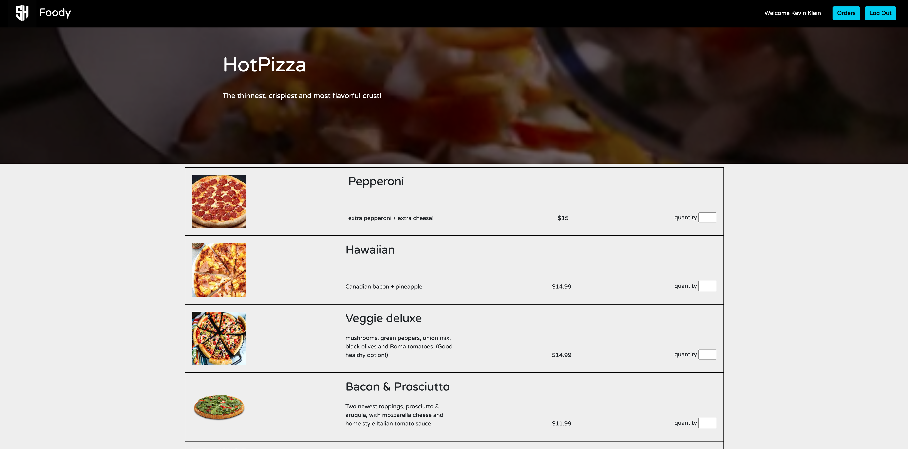
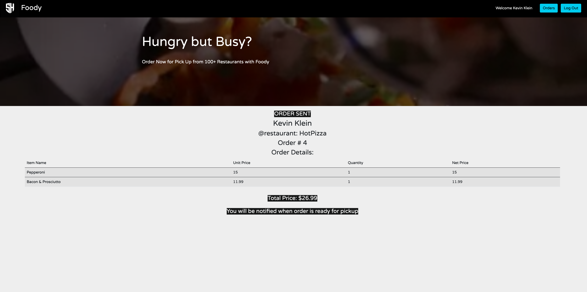
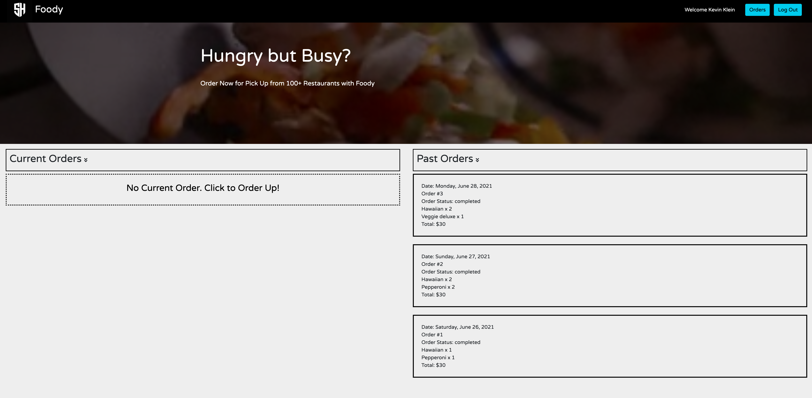

# Foody
=========

This project has been developed as midterm project for Lighthouse Labs Bootcamp. This a food ordering service app. Food can be ordered from any of the multiple restaurants enrolled with the app. Customer has to login to place and order. Past and current orders can be accessed. When an order is placed by the customer, an SMS update is sent to the customer and the restaurant. The restaurant can update the status of the order through SMS. Customer will in turn receive these updates.

This product is a joint work  of Shree Devi Yadam and Hotae Kevin Kim

## Final Product
###### Main Page (before login)

###### Menu Page (Before login)

###### Login / Register Page

###### Main Page (after login)

###### Menu Page (After login)

###### Confirmed Order Page

###### Past and Current Orders Display Page

## Getting Started

1. Create the `.env` by using `.env.example` as a reference: `cp .env.example .env`
2. Update the .env file with your correct local information 
  - username: `labber` 
  - password: `labber` 
  - database: `midterm`
3. Also update Twilio Account SID AUTHTOKEN AND Outgoing phone number.
4. Install dependencies: `npm i`
5. Fix to binaries for sass: `npm rebuild node-sass`
6. Reset database: `npm run db:reset`
  - Check the db folder to see what gets created and seeded in the SDB
7. Run the server: `npm run local`
  - Note: nodemon is used, so you should not have to restart your server
8. Visit `http://localhost:8080/`

## Dependencies

- Node 10.x or above
- NPM 5.x or above
- PG 6.x
- TWILIO 3.64 or above
- COOKIE-SESSION
- BCRYPT
- LODASH

